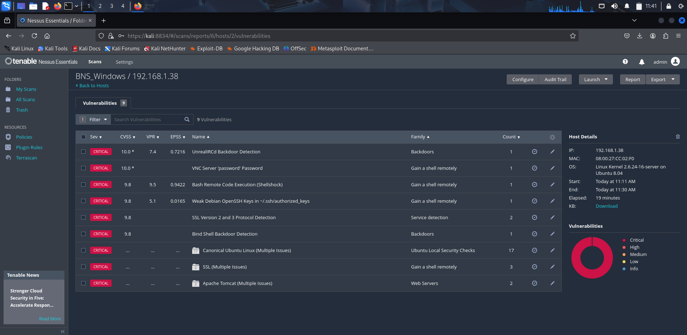

## 🛡️Task 3: Basic Vulnerability Scan Using Nessus Essentials

## 🔍 Overview
As part of Task 3 in my cybersecurity journey, I performed a **Basic Vulnerability Scan** on a virtual machine (Metasploitable) using **Nessus Essentials**, a widely used vulnerability assessment tool.

## Tools Used:
1) **Nessus Essentials**
2) **Metasploitable VM** (vulnerable target)
3) **Kali Linux** (hosted Nessus interface)

## 📝 What I Did?

1. **Setup Nessus Essentials** on Kali Linux and registered using a valid activation code.
2. Launched the **Basic Network Scan** template.
3. Set the **target IP** as my Metasploitable VM's IP address (e.g., `192.168.1.xxx`).
4. Initiated the scan and monitored progress via the Nessus dashboard.
5. After scan completion, reviewed vulnerability findings sorted by severity (Critical,High, Medium, Low).
6. Exported the scan report in **PDF format**.
7. Captured **5 screenshots** highlighting:

   This is the Initial Pop Up that we get After we start the Nessus Essentials.
   

   This is Image that shows the Scan Results as Success.
   

   This is Image that shows all the Vulneabilites of Various Severity.
   

   
   This image shows the Critical Vulnerabilites Issues.
   

   
   This Image show the Various Level of Issues in the Taget Device.
   
   

## 🧠 Key Learnings
- Understood how credential-less scans work using Nessus
- Identified multiple critical and high-risk vulnerabilities on the target system
- Improved familiarity with security report interpretation and CVE classification
