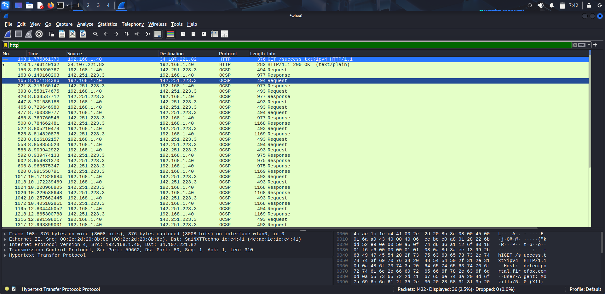
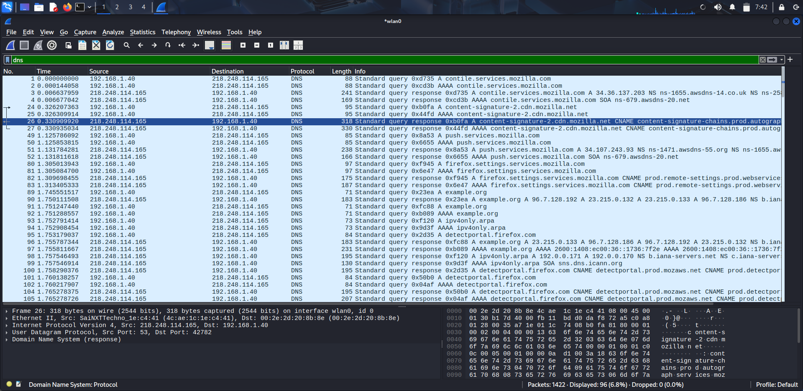
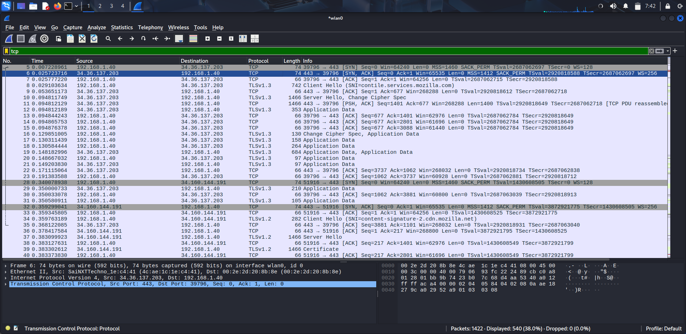

## Capture and Analyze Network Traffic Using Wireshark.

WireShark is a Tool that is used to Capture & Analyse the Network packets in the real time. In a Linux Distro like KALI this tool comes built-in.
So when ever the Packets are captured in Wireshark it has the details like Packet No. ,Time, Source Address, Destination Address, Protocol, Length & Information regarding that packet.

### Working with the WireShark:-
1) If Your OS is Windows / MacOS then install it from here:    [WireShark Download](https://www.wireshark.org/download.html)
2) Once Installation & Configuration are done then Open it.
3) If You are using Kali Linux You are good to go because Wireshark comes built in.
4) Then As soon as you open it Select the Interface through which you are accessing the Internet.  e.g: *wlan0, eth0*
5) Then Select on the Start Capture on the Top - Left side.
6) And open your Favorite Browser & head to any website.
7) Then come back to Wireshark Tab, there You can see a lot of Packets are being Captured & On the Top left side itself you can find "stop capture".
8) Now You have Captured the Packets.


## Now to Filter the captured packets by protocol:
Let's try to see the packets having the HTTP protocol. In order to perform this just copy the below command in the WireShark Filter Bar:

```bash
http
```

If you want TCP just type TCP in the filter bar, & same for DNS.

### I've Identified these Protocols:
  1) HTTP: which stands for the Hyper Text Transfer Protocol. It is a protocol through which all websites interacts with our browser.

     

2) DNS: Which stands for the Domain Name System. It is used to translate the Domain Names(like google.com) into the Valid IP Addresses(192.178.10.12).



3) TCP: Which stands for the Transmission Control Protocol. It is a connection Oriented protocol means, that there should be a connection in order to transmit the Packets & this is also
   reliable.


Before closing the Wireshark tab, just save the file with .pcap extension i.e, Packet Capture.
