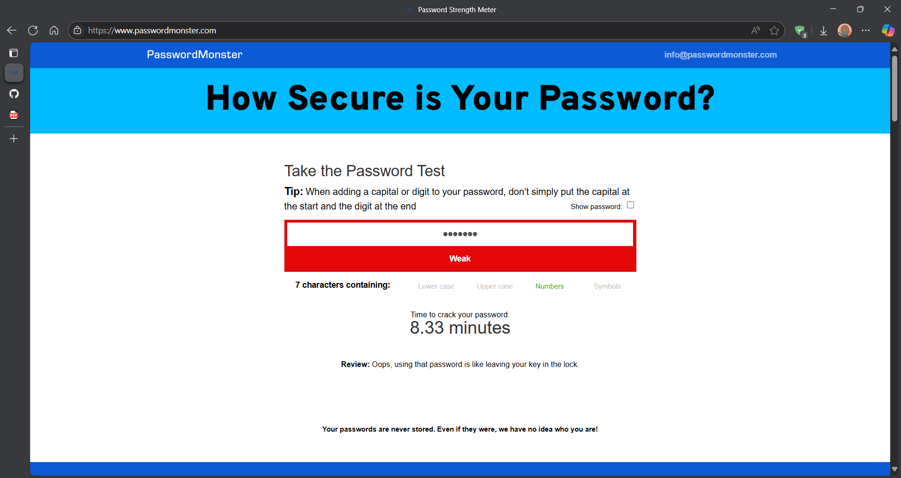
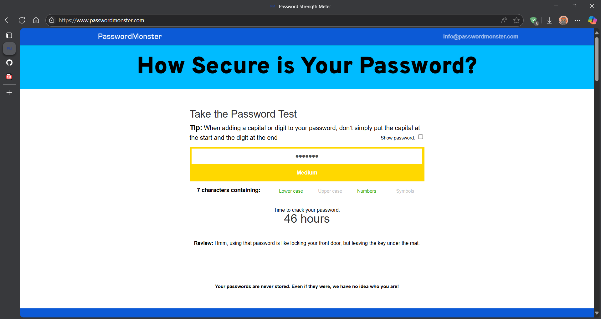
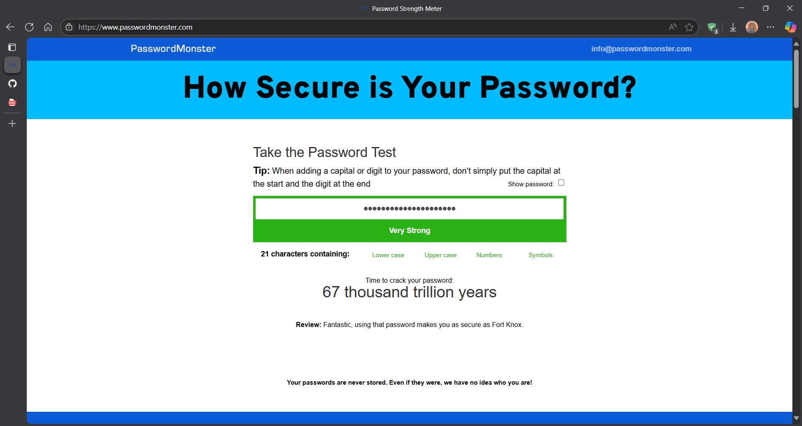

## 🔐 Task 6: Creating a Strong Password and Checking its Strength

### 🛠️ Tools Used
  I've used an Online Password checker tool i.e, : [Password Monster](https://www.passwordmonster.com)
  It's like a tool that displays the Strength, Estimanted Crack Time & Feedback for your password.

### 🧪 What I Did?

#### ✅ Step 1: Created Multiple Passwords
I created a set of passwords with varying complexity:
- Simple: `pavan123`
- Moderate: `Pavan@123`
- Strong: `P@v@n_2024!Secure`
- Passphrase: `Coffee$Rainbows!Jump42`

### ✅ Step 2: To Test Passwords on Strength Checkers
Each password was tested on multiple tools. I noted:
- Strength score (e.g., Weak, Medium, Strong)
- Estimated crack time
- Feedback from the tool

### ✅ Step 3: Analyzed Results
- Longer passwords with symbols, numbers, and mixed case were rated strongest.
- Passphrases were both strong and easier to remember.
- Short or common passwords were flagged as weak or easily guessable.

---

### 📊 Summary of Results

| Password               | Strength (Avg) | Crack Time Estimate     | Notes                             |
|------------------------|----------------|--------------------------|-----------------------------------|
| `pavan123`             | Weak           | < 1 second               | Too short, predictable            |
| `Pavan@123`            | Medium         | A few minutes            | Better, but still guessable       |
| `P@v@n_2024!Secure`    | Strong         | Several centuries        | Excellent complexity              |
| `Coffee$Rainbows!Jump42` | Strong       | Centuries+               | Strong passphrase, memorable      |

---

## 🧠 Key Learnings

- Use **at least 12 characters** with a mix of uppercase, lowercase, numbers, and symbols.
- Avoid using names, birthdays, or common patterns.
- **Passphrases** are a great balance between strength and memorability.
- Password strength tools give useful feedback on how to improve.

## 🔐 Common Password Attacks (Researched)

- **Brute Force**: Tries every possible combination.
- **Dictionary Attack**: Uses a list of common passwords or words.
- **Credential Stuffing**: Uses leaked username-password pairs from other breaches.

## ✅ Best Practices for Strong Passwords

- Use long, complex passwords or passphrases.
- Don’t reuse passwords across sites.
- Use a **password manager** to store and generate secure passwords.
- Enable **multi-factor authentication (MFA)** wherever possible.

### Screenshots showing the Password Strength Results:

