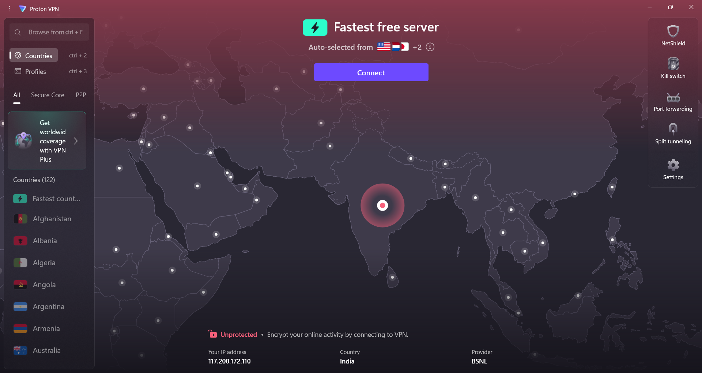
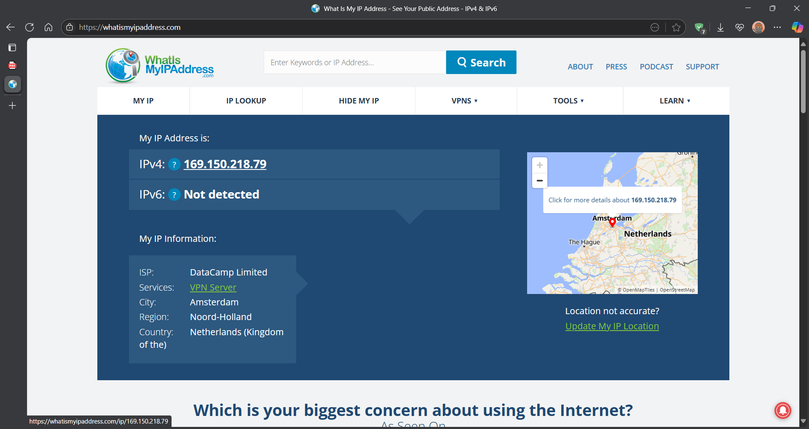

## 🌐 Task 8: Working with VPN

### 🛠️ Tools Used
- [ProtonVPN (Free Tier)](https://protonvpn.com/)
- [WhatIsMyIPAddress.com](https://whatismyipaddress.com/)

### What I Did:-

#### 1. Downloaded ProtonVPN
- Visited the official ProtonVPN website
- Downloaded the Windows11 client

#### 2. Installed and Logged In
- Installed the VPN client & Created a free ProtonVPN account
- Logged in successfully

#### 3. Connected to a VPN Server
- Chose a free server location and connected
- ProtonVPN showed a successful connection status

#### 4. Verified IP Address Change
- Checked my IP address **before** connecting to VPN
- Connected to VPN and checked again
- IP address was successfully changed, confirming VPN tunneling.

#### 5. Verified via Website
- Visited [whatismyipaddress.com](https://whatismyipaddress.com/)
- Confirmed that the IP shown was different from my original IP

### 📸 Screenshots:

- IP address before VPN connection
  

  

- IP address After VPN connection
  

  

### 🔐 VPN Benefits & Limitations

#### ✅ Benefits:
- Hides your real IP address
- Encrypts your internet traffic
- Protects privacy on public Wi-Fi
- Bypasses geo-restrictions

#### ⚠️ Limitations:
- May reduce internet speed
- Free VPNs have limited server options
- Doesn’t guarantee full anonymity
